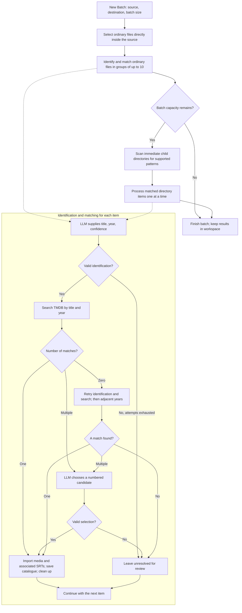

[Documentation index](../index.md) · [Directory patterns](directory-patterns.md) · [Import and cleanup](import-cleanup.md)

A batch starts when the user chooses **New Batch**. R3el handles files directly
inside the source first, then scans immediate child directories for supported
patterns. The destination defaults to `/exports/disk1/archive/media/movies`.

**Batch size counts selections, not displayed rows.** An ordinary file counts
as one; a matched directory also counts as one, even when it yields several
movies. Unmatched directories are left untouched. Nested directories contribute
to their parent's scan, but are not separately queued.

The overview groups retries for readability: identification allows two corrective
retries; zero TMDB results allow three fresh identifications before searches at
the final year minus one and plus one. Individual unresolved results do not
prevent the batch finishing. Unexpected processing errors can stop it.

**Stop Batch** finishes the current operation before stopping. **Clear Current
Batch** requests a stop if necessary, waits for the worker to release the
workspace, then clears working records. Catalogue entries, imported files, and
Event Log history remain. **Current Task:** shows the latest batch event.

See [Directory patterns](directory-patterns.md) for discovery decisions,
[Import and cleanup](import-cleanup.md) for filesystem operations, and
[Persistent workspace](file-states.md) for saved states.
