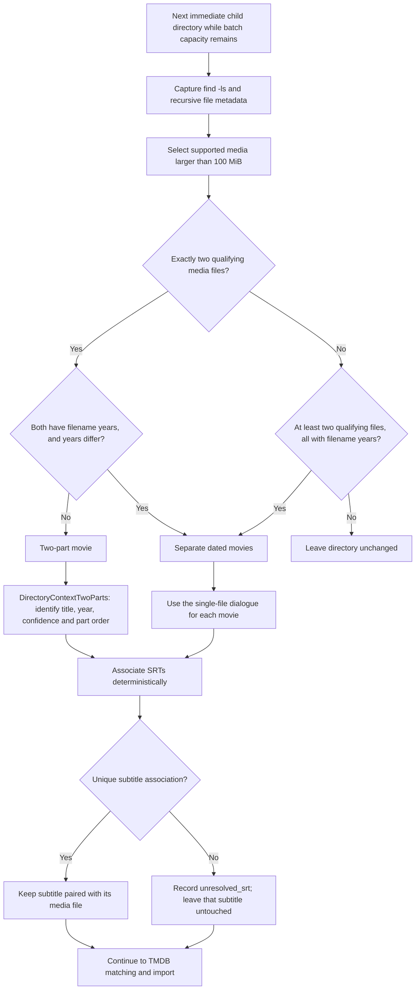

[Documentation index](../index.md) · [Batch overview](flowchart.md) · [Import and cleanup](import-cleanup.md)

TV patterns are checked before the movie patterns below; see [TV show imports](tv-shows.md).

Directory discovery runs after ordinary files. Only immediate child directories
of the source are candidates. Each candidate is scanned recursively using
`find -ls`; the destination is excluded. Supported media must be **larger than
100 MiB** to qualify for pattern matching.

Subtitle associations are established during discovery, before the dialogues;
the diagram groups them below both pattern branches because both use the same
rules. Part numbers are assigned after the two-part dialogue.

A year is recognized at the beginning or end of the filename stem, before its
extension, with supported separators or brackets. Two files with the same year
take the two-part route. Two files also take that route if one or both lack a
recognized year. Different years rule out the two-part pattern.

The separate-movies pattern needs at least two qualifying files and a year in
every filename. For example, `Alice-in-Wonderland-2010.avi` and
`Alice-through-the-Looking-Glass-2016.avi` are identified separately. The whole
directory still counts as one batch selection.

SRT matching prefers a matching basename in the same folder, then a unique
basename elsewhere in the scanned directory. If names differ, one video and one
SRT alone in the same folder can be paired. Multiple subtitles targeting the same
video are ambiguous because their renamed destinations would collide.
Ambiguous associations become `unresolved_srt`; no LLM subtitle matching is used.

The media format preference order is documented in [File naming](file-naming.md).
The size filter above is for discovery only; cleanup checks **all** supported
media, regardless of size, throughout the source tree.
