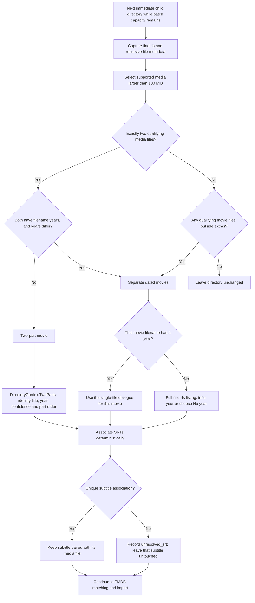

[Documentation index](../index.md) · [Batch overview](flowchart.md) · [Import and cleanup](import-cleanup.md)

TV patterns are checked before the movie patterns below; see [TV show imports](tv-shows.md).

Directory discovery runs after ordinary files. Only immediate child directories
of the source are candidates. Each candidate is scanned recursively using
`find -ls`; the destination is excluded. Supported media must be **larger than
100 MiB** to qualify for pattern matching.

```mermaid
flowchart TD
    Start["Next immediate child directory while batch capacity remains"] --> Scan["Capture find -ls and recursive file metadata"]
    Scan --> Filter["Select supported media larger than 100 MiB"]
    Filter --> Two{"Exactly two qualifying media files?"}
    Two -->|Yes| Years{"Both have filename years, and years differ?"}
    Years -->|No| Parts["Two-part movie"]
    Years -->|Yes| Separate["Separate dated movies"]
    Two -->|No| Many{"Any qualifying movie files outside extras?"}
    Many -->|Yes| Separate
    Many -->|No| Leave["Leave directory unchanged"]
    Parts --> PartsLLM["DirectoryContextTwoParts: identify title, year, confidence and part order"]
    Separate --> HasYear{"This movie filename has a year?"}
    HasYear -->|Yes| SingleLLM["Use the single-file dialogue for this movie"]
    HasYear -->|No| YearLLM["Full find -ls listing: infer year or choose No year"]
    PartsLLM --> Subtitles["Associate SRTs deterministically"]
    SingleLLM --> Subtitles
    YearLLM --> Subtitles
    Subtitles --> Unique{"Unique subtitle association?"}
    Unique -->|Yes| Keep["Keep subtitle paired with its media file"]
    Unique -->|No| Unresolved["Record unresolved_srt; leave that subtitle untouched"]
    Keep --> Matching["Continue to TMDB matching and import"]
    Unresolved --> Matching
```

Subtitle associations are established during discovery, before the dialogues;
the diagram groups them below both pattern branches because both use the same
rules. Part numbers are assigned after the two-part dialogue.

A year is recognized at the beginning or end of the filename stem, before its
extension, with supported separators or brackets. Two files with the same year
take the two-part route. Two files also take that route if one or both lack a
recognized year. Different years rule out the two-part pattern.

Single movies inside directories are selected. Collections that do not match
the TV or two-part routes are also selected as individual movies, even if some
or all filenames lack years. Recognized extras, samples, trailers and featurettes
are excluded from this individual-movie route. The whole directory still counts
as one batch selection.

Only a selected movie without a recognized filename year enters the missing-year
conversation. The LLM receives its assigned filename and the full `find -ls`
listing, including other files that may identify the release year. It supplies
the movie title, a guessed year or **No year** (`null`), and confidence.
Filesystem timestamps are not release-year evidence.

R3el then queries TMDB with that title and the guessed year, or omits the year
when the LLM chooses No year. A guessed-year search with exactly one result
proceeds to import. Otherwise the results return to the LLM in a separate
selection step, together with the directory listing and candidate release dates.
No-year searches always use this selection step, even for one or zero results.
The LLM can choose no match; unresolved items remain visible. This route does
not run the ordinary zero-result identification retries or adjacent-year searches.

SRT matching prefers a matching basename in the same folder, then a unique
basename elsewhere in the scanned directory. If names differ, one video and one
SRT alone in the same folder can be paired. Multiple subtitles targeting the same
video are ambiguous because their renamed destinations would collide.
Ambiguous associations become `unresolved_srt`; no LLM subtitle matching is used.

The media format preference order is documented in [File naming](file-naming.md).
The size filter above is for discovery only; cleanup checks **all** supported
media, regardless of size, throughout the source tree.
