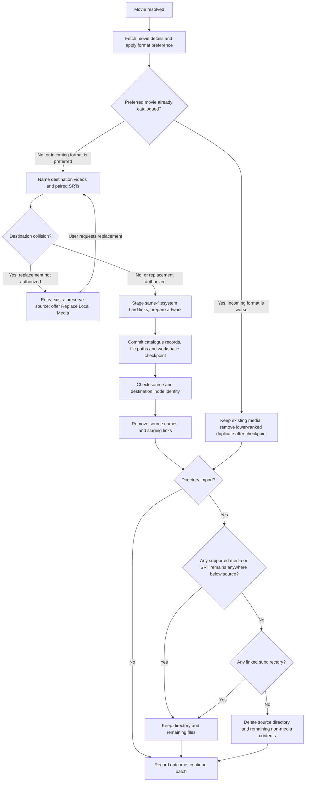

[Documentation index](../index.md) · [Batch overview](01-high-level-flow.md) · [Directory patterns](directory-patterns.md)

One TMDB match, an accepted LLM selection, or a manual TMDB ID identifies the
movie to import. Its TMDB title and release year determine the destination names.

Moves use hard links and unlink operations within one filesystem. **Media bytes
are neither copied nor read back for verification.** Sources remain until the
catalogue transaction commits. Inode checks use filesystem metadata, not content
checksums. A different-filesystem destination fails rather than silently copying.

SRTs move alongside their associated videos and receive the same stem. Two-part
movies use `Title (Year) Part 1.ext` and `Title (Year) Part 2.ext`; paired
subtitles use the corresponding `.srt` names. See [File naming](file-naming.md).

Directory cleanup checks recursively, including subdirectories of any depth.
Remaining videos of any supported size, unresolved SRTs, and linked subdirectories
prevent removal of the source tree. A directory with no such content can be
removed, including release notes. For a directory containing separate movies,
this check follows each movie's completion, so the remaining movies keep it alive.

The diagram shows the successful path and destination conflicts. Filesystem or
catalogue errors preserve sources until the commit/removal boundary and record an
error for review. Format-preference deletion is distinct from an exact-path
collision: the latter requires **Replace Local Media**.

See [Catalogue schema](schema.md) for transactions and stored paths and
[Control and Event Log](control-server.md) for monitoring.
